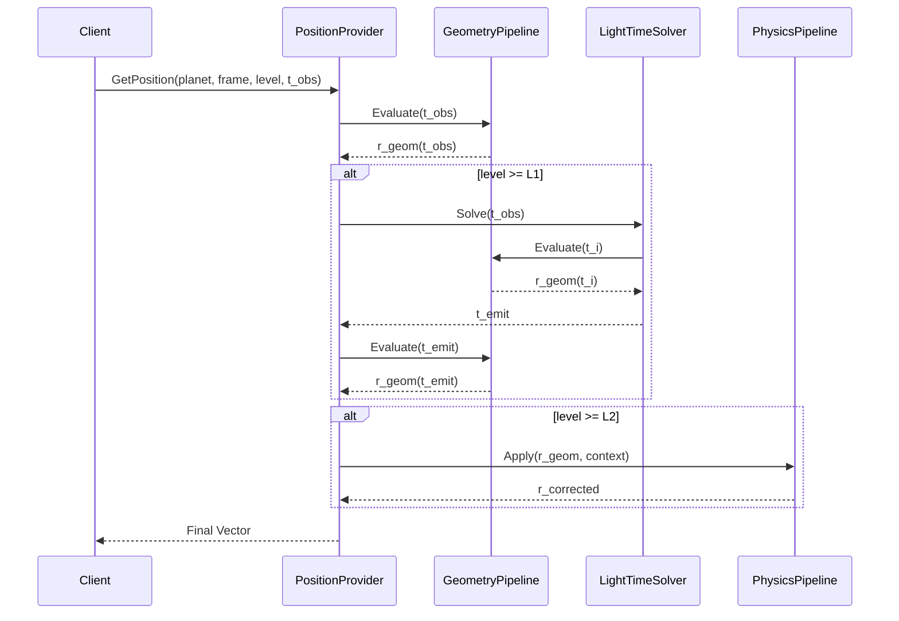

# Architecture Freeze – Ephemerides Pipeline L0–L5

Version: 1.0  
Date: 2026-03-03  
Project: Astronometria  

---

# 1. Purpose

This document freezes the final structural definition of the Astronometria Ephemerides Pipeline
for correction levels L0 through L5.

It reflects:

- Architecture Freeze V2 (time domain separation)
- Fundamental Definitions V2 (TT-only Astro Domain)
- Orthogonal Geometry/Physics pipeline principle
- Light-Time Fundamental Concept (L1)

This document is normative.

Any modification requires explicit versioning and mesh revalidation.

---

# 2. Domain Constraints

## 2.1 Time Domain

All ephemeris computations operate exclusively in:

    TtInstant (TT)

UTC is strictly forbidden inside the ephemeris pipeline.

Time conversion occurs outside the Astro Domain.

## 2.2 Units

- Position: AU
- Velocity: AU/day
- Time: Julian day (TT)
- Light speed: AU/day

---

# 3. Correction Level Definition

Correction levels are strictly ordered and cumulative.

| Level | Definition | Domain |
|--------|------------|--------|
| L0 | Pure geometric position | Space |
| L1 | L0 + Light-Time | Time |
| L2 | L1 + Aberration | Space |
| L3 | L2 + Relativistic Deflection | Space |
| L4 | L3 + Topocentric Correction | Space |
| L5 | L4 + Atmospheric Refraction | Space |

Light-Time is the only time-iteration stage.

All other stages are spatial transformations.

---

# 4. Geometry Pipeline (L0)

The Geometry Pipeline is executed for every request.

Strict order:

    VSOP → Origin → Plane → Epoch

## 4.1 VSOP

- Heliocentric ecliptic J2000
- Fundamental planetary theory

## 4.2 Origin

- Helio: return as-is
- Geo: Planet_HE − Earth_HE
- Earth must always be obtained from VSOP in fundamental frame

## 4.3 Plane

- Ecliptic ↔ Equatorial
- Constant rotation (mean obliquity ε₀)

## 4.4 Epoch

- J2000: no change
- OfDate: Precession → Nutation

Output:

    r_geom(t_obs)

---

# 5. Light-Time Solver (L1)

Executed only if correctionLevel >= L1.

## 5.1 Mathematical Definition

Solve:

    t_emit = t_obs − |r(t_emit)| / c

This is a fixed-point equation in time.

## 5.2 Iteration

Initialize:

    t0 = t_obs

Iterate:

1. r(t_i) via Geometry Pipeline
2. τ_i = |r(t_i)| / c
3. t_{i+1} = t_obs − τ_i

Stop when:

    |t_{i+1} − t_i| < 1e-12 days

Maximum iterations:

    10 (safety only)

## 5.3 Re-evaluation

After convergence:

    r_geom(t_emit)

If level == L1 → return this vector.

---

# 6. Physics Pipeline (L2–L5)

Executed only if correctionLevel >= L2.

Strict linear order:

    Aberration
    → Relativistic Deflection
    → Topocentric
    → Atmospheric Refraction

Each stage:

- Knows only its own physics
- Checks context level
- Returns transformed vector

No stage may alter time.

No stage may reorder previous transformations.

---

# 7. Complete Execution Order

For request:

    GetPosition(planet, frame, level, t_obs)

The execution order is:

1. r_geom(t_obs)

2. If level >= L1:
       Solve Light-Time → t_emit
       r_geom(t_emit)

3. If level >= L2:
       Apply Aberration
       Apply Relativistic Deflection
       Apply Topocentric
       Apply Refraction

4. Return final vector

---

# 8. Sequence Diagram

---

# 9. Velocity Provider

Velocity is computed via symmetric numerical differentiation:

    v(t) = (r(t + Δ) − r(t − Δ)) / (2Δ)

Where r(t) is the full pipeline result.

Consequences:

- Light-Time automatically included
- All spatial corrections included
- No duplicated correction logic

---

# 10. Architectural Properties

This architecture guarantees:

- Strict time-domain separation
- Orthogonality of Geometry and Physics
- Deterministic execution
- Mesh stability (1600–2500)
- Extendability (e.g. TDB, DE integration)
- Debuggability at each stage

Light-Time is explicitly modeled as a time solver,
not as a vector decorator.

---

# 11. Freeze Status

This document freezes:

- CorrectionLevel semantics
- Stage ordering
- Time iteration location
- Geometry/Physics separation

Changes require:

- Version increment
- Full mesh validation
- Regression re-baselining

---

End of document.
