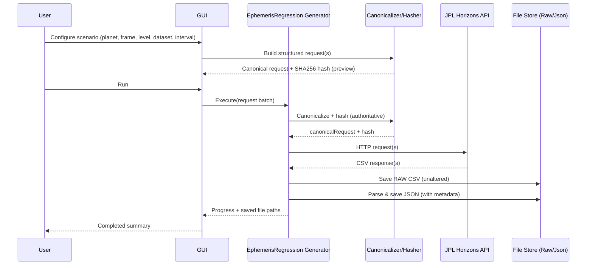

# EphemerisRegressionGUI – M1 Specification (Test Data Generator)

Version: 1.0  
Date: 2026-03-03  
Project: Astronometria / EphemerisRegression  

---

## 1. Mission and Scope

EphemerisRegressionGUI exists for **test data generation only**.

It must **not** become a scientific analysis tool.

Out of scope (explicitly forbidden for M1):

- Plots, statistics, deviation analysis
- Visual comparison of runs
- “Explore the sky” features
- Anything that duplicates Astronometria rendering or reporting

The GUI is a deterministic front-end for generating reproducible **Horizons** reference datasets.

---

## 2. Core Outputs

Every run can produce:

- **RAW CSV**: unmodified Horizons output (byte-identical content except file system line endings)
- **JSON**: parsed values + metadata for regression tests

JSON must always contain:

- canonicalRequest (normalized, newline-separated `KEY=VALUE` format)
- requestHash (SHA256 over canonicalRequest, uppercase hex)
- canonicalizationVersion
- engineVersion
- generatedAtUtc
- dataset descriptor (planet, mode, frame, level, time window, step, chunk info)
- Horizons URL (optional traceability field)

RAW CSV must remain unmodified. All metadata belongs in JSON only.

---

## 3. Orthogonal Pipeline Abstraction (GUI Model)

The GUI exposes **outputs**, not internal implementation details.

### 3.1 Geometry / Frame Selector

Maps to Astronometria Geometry Pipeline:

`VSOP → Origin → Plane → Epoch`

User options:

- **Origin**
  - HELIO (Sun-centered, @10 equivalent)
  - GEO (Earth-centered, 500@399 equivalent)
- **Plane**
  - ECLIPTIC
  - EQUATORIAL
- **Epoch**
  - J2000
  - OF_DATE

### 3.2 Correction Level Selector (L0–L5)

Aligned with the frozen pipeline ordering:

- L0: Geometric
- L1: Light-Time (time iteration; implemented outside correction engine, but still a level)
- L2: Aberration
- L3: Relativistic Deflection
- L4: Topocentric
- L5: Atmospheric Refraction

Important:
- The GUI must not implement ordering logic. It only selects a **level**.
- The generator applies the authoritative mapping for Horizons parameters.

---

## 4. Dataset Types for M1

### 4.1 Preset Suites (TS-A … TS-E)

The GUI must offer presets that define:

- which generator is used (quadrants, nodes, distance extrema, RA/DEC, boundary tests)
- standard windowing rules (e.g., ±1 day around event)
- standard step sizes (e.g., 1h)
- required Horizons ephemeris type (VECTORS vs OBSERVER)

Presets must remain transparent:
- the resulting Start/Stop/Step is always shown before execution
- canonical request preview is always shown before execution

### 4.2 Mesh Datasets (M1-critical)

Mesh is first-class.

Mesh modes (normative defaults):

1. **Coarse Mesh**
   - Range: 1600–2500
   - Step: 10 years
2. **Annual Mesh**
   - Range: 1600–2500
   - Step: 1 year
3. **Boundary-Dense Mesh**
   - Ranges: 1600–1700 AND 2400–2500
   - Step default: 90 days (configurable)

For mesh datasets the generator must support chunking/batching while preserving:

- global equidistance across chunks
- deterministic chunk boundaries
- deterministic file naming

---

## 5. Horizons Request Model (Canonical + Hash)

### 5.1 Principle

The GUI must not allow free-form URL editing that bypasses canonicalization.

Users configure a structured request (scenario).
The generator renders it canonically and hashes it.

### 5.2 Canonical parameters (normative)

Canonicalization must follow the project’s Fundamental Definitions (canonical list + ordering + formatting).

Key rules (summary):

- uppercase parameter names
- ISO-like time formatting (no whitespace)
- stable parameter ordering (alphabetical by key)
- STEP_SIZE with explicit units (e.g., `1h`, `10y`)
- exclude null/empty values

---

## 6. GUI Layout (M1)

### 6.1 Scenario panel

Inputs defining the dataset:

**Target**
- planet (Mercury … Neptune)
- optional filter: hide Earth in GEO mode

**Pipeline output selection**
- Origin (HELIO/GEO)
- Plane (ECLIPTIC/EQUATORIAL)
- Epoch (J2000/OF_DATE)
- CorrectionLevel (L0–L5)

**Dataset**
- Preset suite (TS-A … TS-E) OR Mesh OR Interval

**Time interval**
- Start (calendar input or JD input)
- Stop (calendar input or JD input)
- Step (value + unit)

**Output**
- root output folder
- toggles: RAW CSV yes/no, JSON yes/no (defaults: yes/yes)

**Determinism locks (read-only)**
- canonicalizationVersion
- hash algorithm (SHA256)

### 6.2 Preview panel (determinism preview)

Not analysis; only determinism:

- canonical request preview (read-only)
- computed hash preview (read-only)
- derived Horizons URL (read-only, optional)
- expected output file paths (read-only)
- expected number of requests (batch size, number of chunks)

### 6.3 Run panel

- Run
- Cancel (stop after current request)
- Progress (done/total)
- Log tail (hash + status + saved file paths)
- Dry run (optional): compute canonical + hash + file plan without API calls

---

## 7. Output Layout (Normative)

Root layout:

`Horizons/<Mode>/<Dataset>/<Level>/<Raw|Json>/`

Where:
- Mode ∈ `Helio`, `Geo`, `Observer`
- Dataset ∈ `TS-A`, `TS-B`, `TS-C`, `TS-D`, `TS-E`, `Mesh`
- Level ∈ `L0` … `L5`

File naming requirements:

- must include: Planet, Dataset, Mode (if ambiguous), Level, Chunk/Segment (if chunked)
- must be deterministic from the scenario + chunk index

---

## 8. Execution Flow (Sequence Diagram)

---

## 9. Horizons Mapping per Level (M1 Plan)

The generator owns the mapping from (Mode, Frame, Level) → Horizons parameters.

Normative goal:
- the mapping is documented and versioned
- any mapping change increments a mapping version and requires re-baselining

Notes for M1 planning:
- L0 datasets use VECTORS with no vector corrections.
- L1 datasets must reflect Light-Time semantics consistently (as defined in Astronometria).
- L4/L5 may require OBSERVER mode and a fixed observer definition (see Project Plan gates).

---

## 10. M1 Acceptance Criteria (GUI)

GUI is M1-ready when it can deterministically generate:

- all planets (Mercury … Neptune)
- all levels L0–L5 (even if Horizons mapping differs per level)
- mesh datasets (coarse + annual + boundary-dense)
- stable output layout and file naming
- canonical request + hash preview
- reproducible reruns (same inputs → same hashes → same file plan)

---

End of document.
